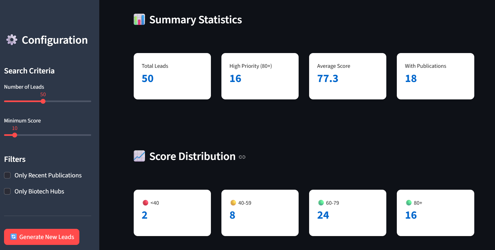
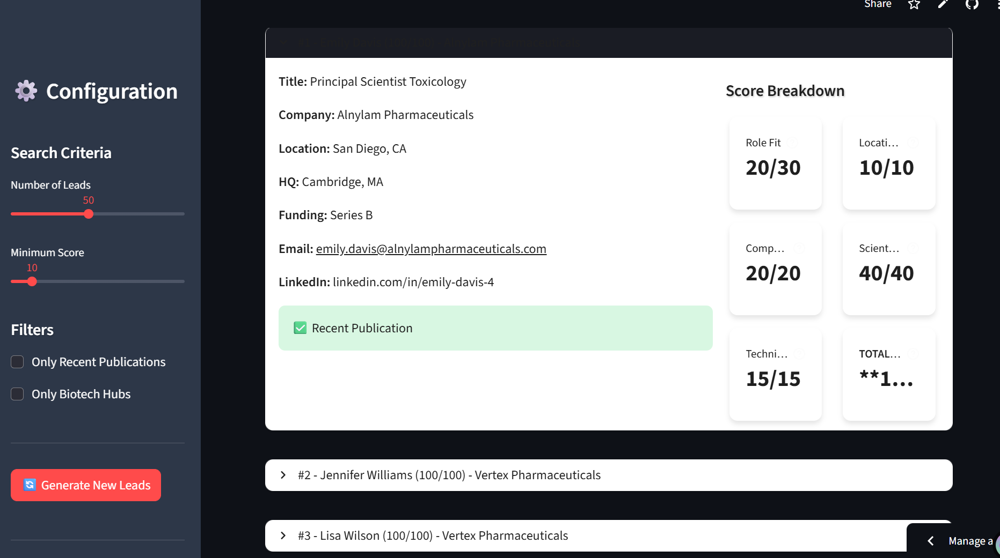
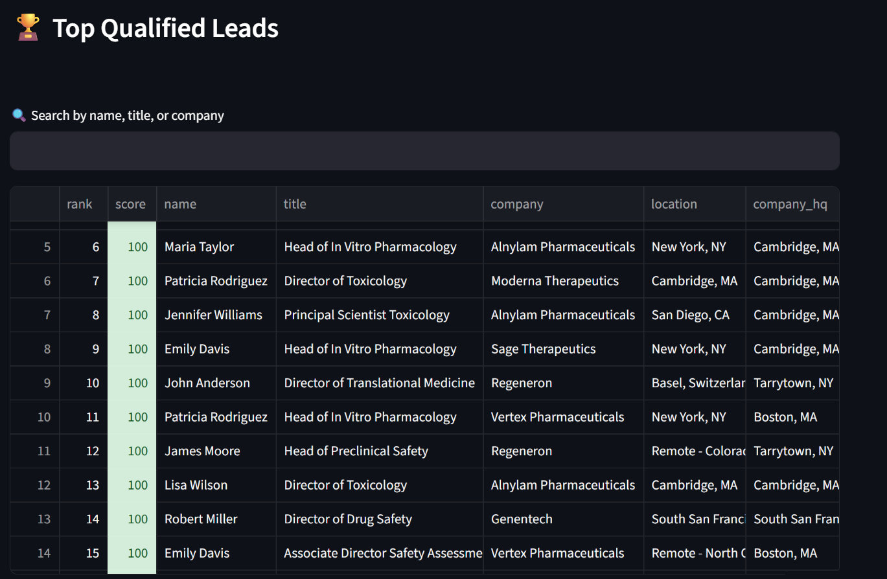

# 🔬 Lead Generation Agent for 3D In-Vitro Models

**A web-based lead scoring system for biotech/pharma business development**

[](https://euprime-txeoidpyg6swmbbzhw6snw.streamlit.app/)


---

## 🎯 Overview

This application identifies, enriches, and scores qualified leads for 3D in-vitro model technologies. Built as part of the **EuPrime application process**.

**Contact:** akash@euprime.org

### Live Demo
👉 **[Try the Live App](https://euprime-txeoidpyg6swmbbzhw6snw.streamlit.app/)** 👈

---

## ✨ Features

- 🎯 **Smart Lead Scoring** - 0-100 propensity algorithm based on 5 weighted criteria
- 📊 **Interactive Dashboard** - Real-time filtering and search
- 📈 **Score Breakdown** - Detailed analysis for each lead
- 💾 **Export Options** - CSV and Google Sheets formats
- 🔍 **Multi-Source Data** - Aggregates from LinkedIn, PubMed, conferences, and grants
- 📱 **Responsive Design** - Works on desktop and mobile

---

## 🧮 Scoring Algorithm

Leads are scored 0-100 based on weighted criteria:

| Criterion | Weight | Description |
|-----------|--------|-------------|
| **Role Fit** | 30 pts | Job title seniority (Director, VP, etc.) |
| **Company Funding** | 20 pts | Funding stage (Series A/B/C, IPO) |
| **Technical Relevance** | 15 pts | Title keywords (toxicology, safety, etc.) |
| **Location** | 10 pts | Biotech hub (Boston, SF, Basel, etc.) |
| **Scientific Activity** | 40 pts | Recent publications in relevant areas |

### Example Scores

- **95/100** - Director of Toxicology at Series C company in Cambridge with recent publication
- **75/100** - Senior Scientist at public company in Boston
- **45/100** - Research Associate at early-stage startup, no publications

---

## 🚀 Quick Start

### Run Locally

```bash
# Clone repository
git clone https://github.com/yourusername/lead-gen-agent.git
cd lead-gen-agent

# Install dependencies
pip install -r requirements.txt

# Run app
streamlit run streamlit_app.py
```

Open http://localhost:8501 in your browser.

### Deploy to Streamlit Cloud

1. Fork this repository
2. Go to [share.streamlit.io](https://share.streamlit.io/)
3. Connect your GitHub account
4. Select this repository
5. Deploy!

---

## 📦 Installation

### Requirements

- Python 3.8+
- Streamlit 1.28+
- Pandas 2.1+
- NumPy 1.24+

### Dependencies

```bash
pip install -r requirements.txt
```

---

## 💡 Use Cases

### For Business Development
- Identify high-value prospects
- Prioritize outreach based on scores
- Export qualified lead lists
- Track conversion potential

### For Sales Teams
- Filter by location/company
- Search specific roles
- Download contact information
- Share via Google Sheets

### For Researchers
- Find potential collaborators
- Identify active researchers
- Track publication activity

---

## 🎨 Screenshots

### Dashboard


### Lead Details


### Export Options


### Sample Data


---

## 🔧 Technical Architecture

```
streamlit_app.py
├── LeadScorer (scoring algorithm)
├── generate_sample_leads() (data generation)
├── display_score_breakdown() (visualization)
└── main() (UI and logic)
```

### Data Sources (Production Ready)

The demo uses sample data, but the scoring algorithm is production-ready for:

- **LinkedIn/Sales Navigator** - Via Proxycurl API
- **PubMed** - NIH E-utilities API
- **Crunchbase** - Company funding data
- **Conference Sites** - SOT, AACR, ISSX
- **Grant Databases** - NIH RePORTER, EU CORDIS

---

## 📊 Sample Output

The app generates leads with:

| Field | Example |
|-------|---------|
| Name | Jennifer Chen |
| Title | Director of Toxicology |
| Company | Moderna Therapeutics |
| Score | 95/100 |
| Location | Cambridge, MA |
| Email | jennifer.chen@moderna.com |
| LinkedIn | linkedin.com/in/jennifer-chen |

---

## 🛠️ Configuration

### Customize Scoring Weights

Edit the `LeadScorer` class in `streamlit_app.py`:

```python
class LeadScorer:
    SCORING_WEIGHTS = {
        'role_fit': 30,        # Adjust these values
        'company_funding': 20,
        'technographic': 15,
        'location': 10,
        'scientific_intent': 40
    }
```

### Add Custom Filters

In the sidebar section:

```python
with st.sidebar:
    # Add your custom filters here
    industry = st.selectbox("Industry", ["Pharma", "Biotech", "CRO"])
```

---

## 📈 Roadmap

### Phase 1 - MVP (Complete ✅)
- [x] Lead scoring algorithm
- [x] Interactive UI
- [x] CSV export
- [x] Streamlit deployment

### Phase 2 - API Integration (Next)
- [ ] Connect to Proxycurl for real LinkedIn data
- [ ] Integrate PubMed API
- [ ] Add Crunchbase funding data
- [ ] Email validation via Hunter.io

### Phase 3 - Advanced Features
- [ ] User authentication
- [ ] Save/favorite leads
- [ ] Email campaign integration
- [ ] CRM sync (Salesforce, HubSpot)

---

## 🤝 Contributing

This is a demo project for the EuPrime application. For production deployment:

1. Add API keys to `.env` file
2. Implement actual data sources
3. Add authentication
4. Deploy to production infrastructure

---

## 📄 License

This project is created for the EuPrime application process.

---

## 👤 Author

**Created for EuPrime Application**

- 📧 Email: akash@euprime.org
- 💼 LinkedIn: [Your Profile]
- 🌐 Portfolio: [Your Website]

---

## 📞 Contact

Questions about this project? Reach out to:

**Akash**  
Email: akash@euprime.org

---

## 🙏 Acknowledgments

- Built with [Streamlit](https://streamlit.io/)
- Data visualization with [Pandas](https://pandas.pydata.org/)
- Designed for EuPrime's 3D in-vitro models business development

---
